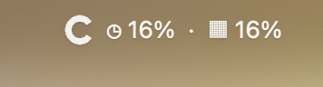
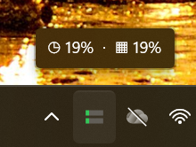
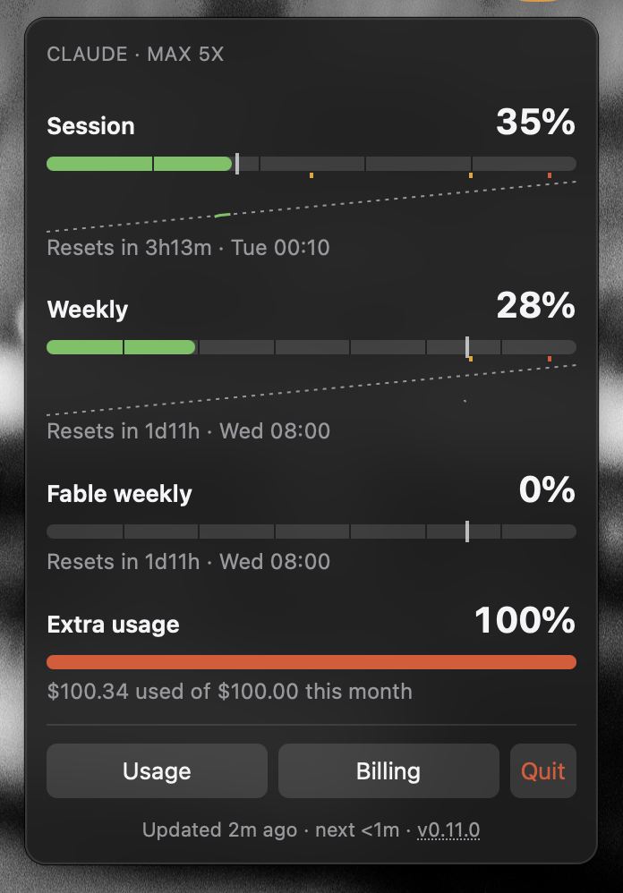
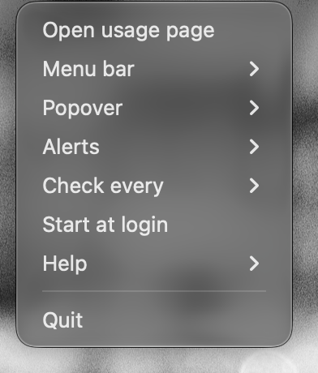
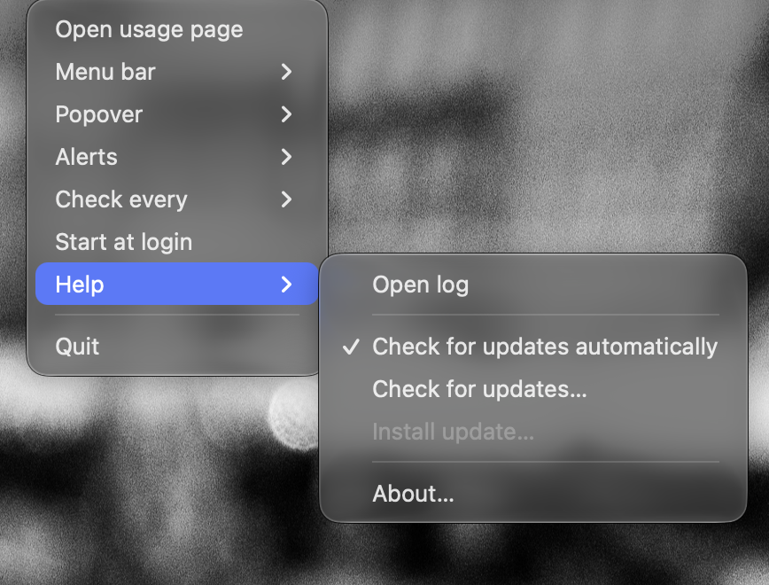
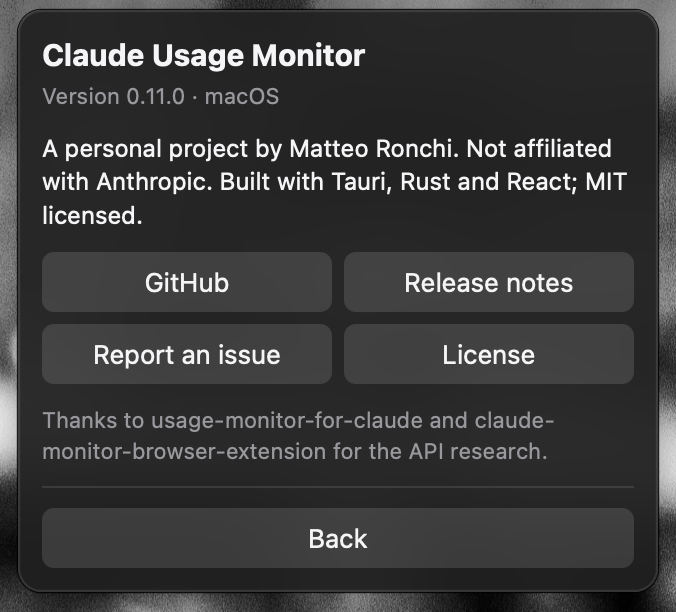

# Claude Usage Monitor

 

A tiny menu bar (macOS) / system tray (Windows) app that shows how much of your Claude plan you
have used: the percentage consumed in the 5-hour session window and in the weekly window, and
the countdown to each reset. Click it for a popover with usage bars, an elapsed-time marker,
alert thresholds, and links to the claude.ai usage and billing pages. Optional notifications warn
you before a quota runs out.

This is a personal project built to scratch my own itch: I wanted the two numbers I look at
most, always visible, without opening a browser tab. It is shared as-is in case it is useful to
you too. It works with a Claude Pro/Max subscription and reads the token that Claude Code has
already stored on your machine — nothing else to configure.

Built with Tauri 2, Rust, React and TypeScript. No third-party UI libraries. MIT licensed.

Website: https://cef62.github.io/claude-usage-monitor/ — downloads, guide and changelog.

| macOS menu bar | Windows tray |
|---|---|
|  |  |

| Popover | Right-click menu |
|---|---|
|  |  |

| Help submenu | About |
|---|---|
|  |  |

## Install

Download the latest build from the
[Releases page](https://github.com/cef62/claude-usage-monitor/releases/latest):

| Platform | File | Notes |
|---|---|---|
| macOS (Apple Silicon, 13+) | `Claude.Usage.Monitor_<version>_aarch64.dmg` | drag the app to Applications |
| Windows 10/11 (x64) | `Claude.Usage.Monitor_<version>_x64-setup.exe` | per-user install, no admin prompt |

Before the first launch:

- **Claude Code** must be installed and logged in (`claude auth login`). The app reuses that
  login and never asks for credentials. See the [Claude Code docs](https://docs.claude.com/en/docs/claude-code).
  Using only the Claude Desktop app? Install Claude Code and log in once with the same account:
  the limits belong to the account, so the numbers match what Desktop and claude.ai show.
- **macOS** warns that it cannot verify the developer (the build is unsigned). Open
  **System Settings → Privacy & Security** and click **Open Anyway**, or run
  `xattr -cr "/Applications/Claude Usage Monitor.app"` once.
- **Windows** shows SmartScreen (the installer is unsigned): click **More info → Run anyway**.
  The installer fetches the WebView2 runtime if it is missing.

Later versions install themselves (see [Updates](#updates)).

## Use

The app has no main window. It lives in the menu bar / tray:

- **Left click** the item to open the popover; click anywhere else (or the item again) to close it.
- **Right click** for the menu: open the claude.ai usage page, settings, alerts, log, quit.
- **Help → About…** (or the version in the popover footer) shows the installed version with
  links to this repository, the release notes, the issue tracker and the license.

### Menu bar (macOS)

Format: `◷ 48% ↻2h13m  ·  ▦ 64% ↻3d4h` — session · weekly, each with the percentage used and
the time until it resets. Other things you may see:

| Text | Meaning |
|---|---|
| `⚠` before a quota | that quota reached its highest alert level |
| ` (429)` after the text | the API is rate limiting; the numbers may be a few minutes old |
| `◷ —` | not logged in to Claude Code — run `claude auth login` (the popover links to the install docs) |
| `◷ ! login` | the stored token expired — run `claude auth login` |
| `◷ ! err` | the last check failed (network, server); the app retries on its own |

### Tray (Windows)

The tray shows no text, so the icon carries the numbers. Hover it for the same text macOS
shows in the menu bar.

- **Top bar** — session quota; **bottom bar** — weekly quota.
- **Green** while usage is behind the clock, **amber** from 80 %, **red** when usage is ahead
  of the clock or the quota is full.
- **Red frame** — an alert level was reached.
- **Red square** in the middle — run `claude auth login`.
- **Grey bars**, no square — the last check failed.

### Popover

A line at the top names your plan (`Claude · Max 5x`), read once per login. Below it, one card
per quota (session, weekly, and any per-model weekly quota the API reports) with the percentage
used, a bar, the reset countdown and clock time. Overlays on the bar:

- **Time ticks** — hour divisions on the session bar, day divisions on the weekly bar.
- **Elapsed marker** — the white line: how far through the reset window you are. If the fill is
  past the marker you are spending faster than the clock and the bar turns red.
- **Threshold marks** — small coloured ticks under the bar at each alert level.
- **History line** — a small graph under the bar: how usage grew over the current reset window,
  with a dotted diagonal for "on pace". The history is kept in `history.json` next to
  `settings.json`, survives restarts and clears itself at each reset.

Also in the popover:

- **Pace forecast** — a line in the session and weekly cards, under the reset time: when you
  reach 100 % at your recent pace, in red, or where you land at the reset if you will not run
  out first. The pace is the last ~43 minutes (session) or 24 hours (weekly); early in a window
  it is the average since the window started. The line disappears while the numbers are stale;
  **Popover → Pace forecast** turns it off.
- **Extra usage** card — if your account has pay-as-you-go overage switched on: credits used
  this month, with a bar and percentage when a monthly limit is set.
- **Footer** — when the numbers were fetched, when the next check is due, and links to the
  claude.ai usage and billing pages.

### Alerts

A system notification fires when a quota crosses an alert level, once per level per reset
window. The first notification triggers the OS permission prompt — allow it.

Everything below follows the quota's **Session** / **Weekly** switch: with a quota's alerts
off, it gets no threshold, reset or run-out notifications.

- The **highest level** of each preset always fires and shows `⚠` in the menu bar.
- **Lower levels** fire only while usage is ahead of the elapsed time, so a steady pace does
  not nag you.
- **Notify on reset** (on by default) — when a quota that reached its top level rolls into a
  new window, a notification tells you it is back to 0 %.
- **Run-out forecast** (on by default) — one notification per window when the pace forecast
  says a quota runs out at least ~43 minutes (session) or a day (weekly) before it resets,
  while it is still below its highest level. It waits for a full ~43 minutes (session) or day
  (weekly) of history, so a burst at the start of a window does not set it off. If a threshold
  alert fires at the same moment, the forecast is added to that notification instead.

### Updates

The app checks the [Releases page](https://github.com/cef62/claude-usage-monitor/releases/latest)
30 seconds after launch and then once a day.

- A newer version brings **one notification** (what changed is in the release notes) and a
  **Help → Install update x.y.z…** item in the tray menu: click it to download, install and
  relaunch. Windows shows the installer's progress bar.
- **Help → Check for updates…** checks on demand and reports the result as a notification.
- **Help → Check for updates automatically** turns the daily check off; the manual item keeps
  working.
- Update packages are signature-checked against a key built into the app, so only releases
  from this repository install.
- Builds older than 0.8.0 have no updater: install 0.8.0 by hand once.
- The signing key was rotated in 0.11.3. Versions 0.11.2 and older can install 0.11.3 but no
  later release: download the latest release by hand once.

## Configure

Everything is in the right-click menu and persists across restarts:

| Menu | Options |
|---|---|
| **Menu bar** (macOS) / **Tray** (Windows) | Session · Weekly · Glyphs (`◷` / `▦`) · Percent · Remaining time. At least one quota and one of Percent/Remaining stay on. On Windows, Session/Weekly also hide the matching bar in the icon; the other three shape the tooltip. |
| **Popover** | Time ticks · Elapsed marker · Threshold marks · History line · Pace forecast |
| **Alerts** | Session · Weekly (on/off) · Notify on reset · Run-out forecast · **Session levels** `80/95` · `50/80/95` · `90/95` · **Weekly levels** `95` · `80/95` · `90` · **Send test notification** |
| **Check every** | 3 · 5 · 10 · 15 minutes (the API rate-limits below 2 minutes, so that is the floor) |
| **Start at login** | registers the app as a login item (macOS: System Settings → General → Login Items, "Allow in the Background"; Windows: `HKCU\…\Run`). Off by default; the check mark always shows what the OS reports. Toggle it from the installed app, not from `pnpm tauri dev`. |
| **Help → Check for updates automatically** | daily background check on/off (default on); **Check for updates…** always works |
| **Help → Open log** | reveals `claude-usage-monitor.log`: poll results, alerts, settings changes — never your token. Rotates at 1 MB. Attach it when reporting a problem. |

Settings file (hand-editing is fine; `session_levels` / `weekly_levels` accept any 1–100 values,
`poll_interval_secs` is clamped to 120–900):

- macOS: `~/Library/Application Support/com.matteo.claude-usage-monitor/settings.json`
- Windows: `%APPDATA%\com.matteo.claude-usage-monitor\settings.json`

## How it works

- **Token** — the Claude Code OAuth token from the macOS Keychain (service
  `Claude Code-credentials`) or `~/.claude/.credentials.json` (`$CLAUDE_CONFIG_DIR` if set) on
  Windows. Never stored, logged, or sent anywhere but `api.anthropic.com`.
- **Requests** — `https://api.anthropic.com/api/oauth/usage` with the same headers Claude Code
  uses, plus one call to `/api/oauth/profile` per login for the plan name.
- **Data** — the API returns percentages only; there are no token counts anywhere.
- **No login of its own** — Anthropic's
  [terms](https://code.claude.com/docs/en/legal-and-compliance#authentication-and-credential-use)
  reserve Claude account logins for Anthropic's own apps and forbid third-party apps from
  offering one or storing claude.ai credentials, so the app has no sign-in screen. It depends
  on Claude Code's login and endpoint; Anthropic can restrict that without notice, and the app
  would then show a login error.
- **Polling** — one request every 3 minutes by default, never two closer than 2 minutes,
  exponential backoff on `429`, and a full stop on `401` until you log in again.

## Not yet

Code signing / notarization, Windows ARM64, Linux.

## Contributing

Bug reports and pull requests are welcome, within the scope described above. See
[CONTRIBUTING.md](CONTRIBUTING.md) for the development setup, project conventions, and how
releases work.

## Acknowledgements

The usage endpoint, its headers, and the rate-limit discipline were learned from two MIT-licensed
projects: [jens-duttke/usage-monitor-for-claude](https://github.com/jens-duttke/usage-monitor-for-claude)
and [claude-monitor/claude-monitor-browser-extension](https://github.com/claude-monitor/claude-monitor-browser-extension).
No code was copied; thanks to their authors for doing the hard part first.

## License

[MIT](LICENSE) © 2026 Matteo Ronchi. Not affiliated with Anthropic.
